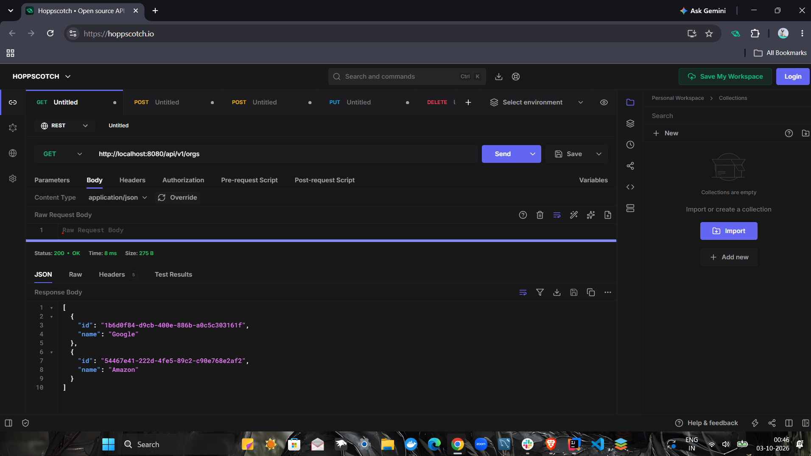
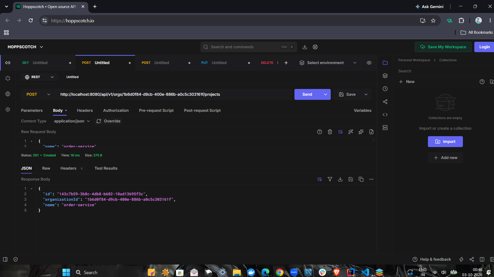
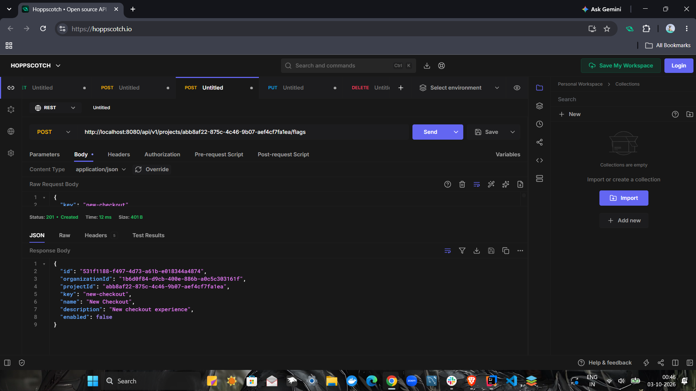
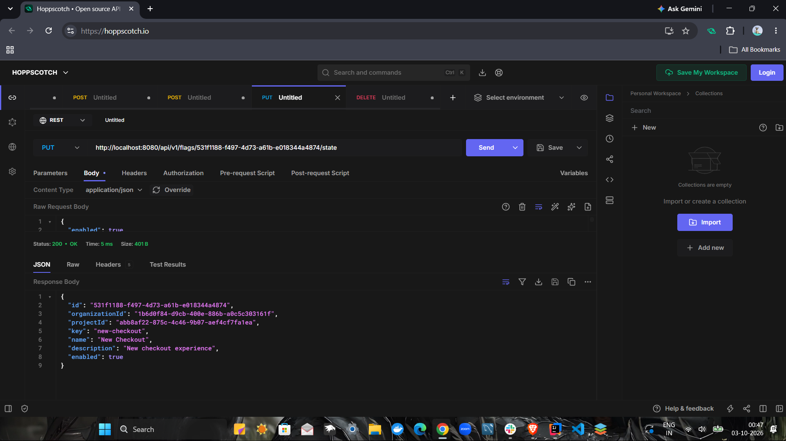
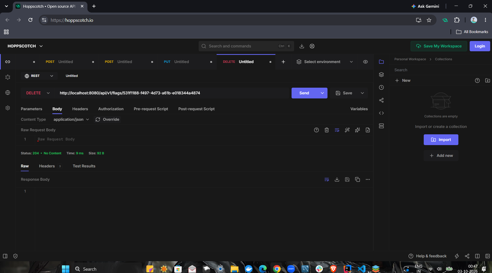
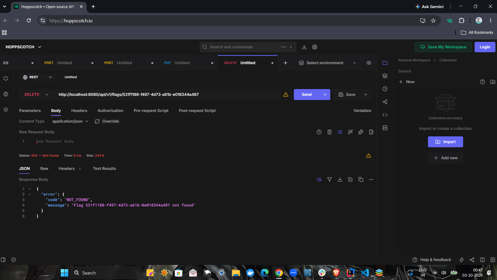

# Switchly_mehak

## ASSIGNMENT FOR SESSION 2

## 1- Add a description field to Flag. Optional when creating. Which files did you have to touch — and which didn't you?. The field should be optional when creating a flag.
## 2- Add DELETE /api/v1/flags/{flagId}. Return 204 No Content. Deleting a flag that doesn't exist should return 404.

### Files Touched

#### 1. Controller Layer — `FlagController.java`

**Change:** Passed the optional description from the request to the service.

```java
request.description()
```

**Location:** Line 34

---

#### 2. DTO Layer — `CreateFlagRequest.java`

**Change:** Added the optional `description` field to the request record.

```java
String description
```

**Location:** Line 14

No validation annotation was added because the description is optional.

---

#### 3. Model Layer — `Flag.java`

**Changes:**

Added the description field:

```java
private final String description;
```

**Location:** Line 12

Added `description` to the constructor:

```java
this.description = description;
```

**Location:** Line 22

Added a getter:

```java
public String getDescription() {
    return description;
}
```

**Location:** Line 31

---

#### 4. Service Layer — `FlagService.java`

**Changes:**

Updated the `create()` method to accept the optional description:

```java
public Flag create(
        UUID projectId,
        String key,
        String name,
        String description)
```

The description is then passed to the `Flag` object when a new flag is created.

The service also contains the existing flag creation, retrieval, state update, and validation logic.

### Result

The API can now accept a flag with or without a description.

**With description:**

```json
{
    "key": "new-checkout",
    "name": "New Checkout",
    "description": "New checkout experience"
}
```

**Without description:**

```json
{
    "key": "new-checkout",
    "name": "New Checkout"
}
```
The `description` field is therefore **optional when creating a flag**.

   
  ## Screenshots

### 1. Create Organization



### 2. Create Project



### 3. Create Flag



### 4. Turn Flag ON



### 5. Check Flag Status



### 6. Delete Flag

    
